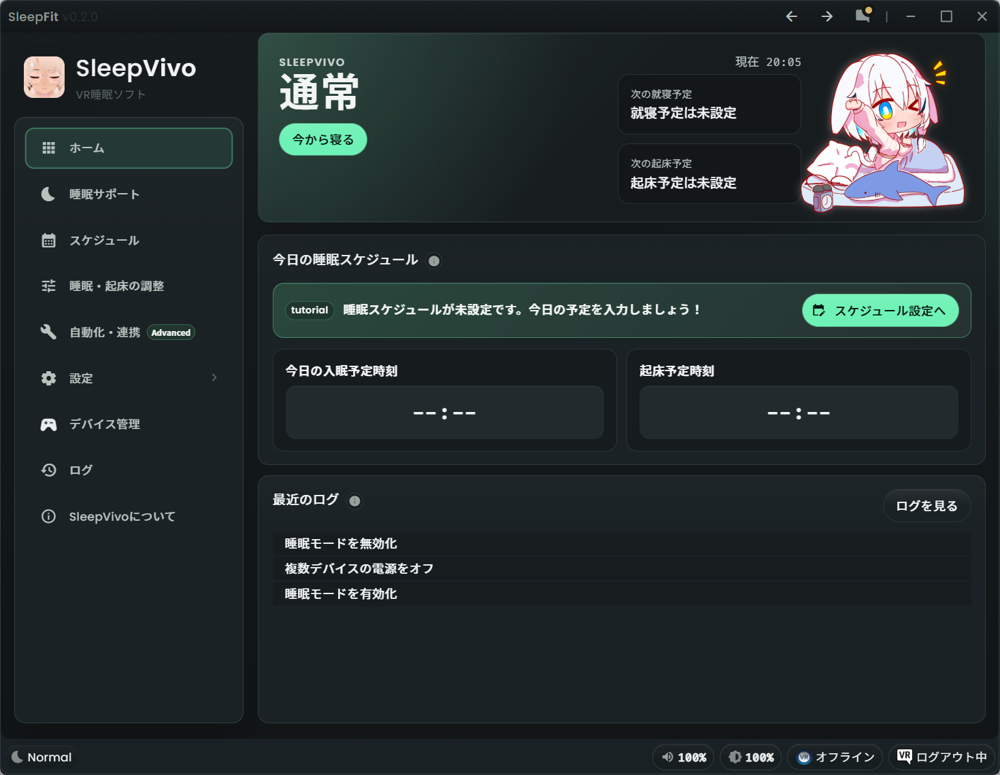

# SleepVivo

SleepVivo は、VR 空間で眠る人のための睡眠支援ソフトウェアです。
寝る時刻と起きる時刻にあわせて、明るさ、色温度、音量などを少しずつ切り替え、入眠と起床を助けます。

現在のドキュメントは Pre-Alpha 版を前提にしています。
画面や配布方法は今後変わる可能性があります。

!!! note "Pre-Alpha 版について"
    小さな違和感や不具合も改善の材料になります。
    気になる点があれば Discord でハルジオン @fleabane_haru に連絡してください。

## まず読むページ

1. [インストール](user-guide/installation.md)で、現在の配布方法を確認します。
2. [初回設定](user-guide/first-setup.md)で、睡眠・起床時刻を設定します。
3. [入眠誘導](user-guide/sleep-induction.md)と[起床誘導](user-guide/wake-induction.md)で、基本の睡眠サポートを確認します。
4. 日によって予定が変わる場合は、[スケジュール](user-guide/scheduler.md)を確認します。

## ドキュメント構成

### ユーザーガイド

インストール、初回設定、睡眠サポート、スケジュール、設定、困ったときの対応をまとめています。
SleepVivo を使う人は、まずここから読んでください。

### Research Program

SleepVivo Research Program は任意参加のプログラムです。
VR 睡眠体験の改善と研究のため、同意した場合のみ睡眠セッションの要約情報を送信します。

参加しない場合でも、SleepVivo の通常機能は利用できます。
詳しくは [Research Program 概要](research-program/overview.md) を確認してください。

### Public Shell

将来的に、透明性の観点から一部コードを公開する可能性があります。
現在、公開されている shell 部分のコードはありません。

## 困ったとき

SleepVivo は現在 Pre-Alpha 版です。
操作に迷った場合や、説明と画面が違う場合は、Discord でハルジオン @fleabane_haru に連絡してください。
