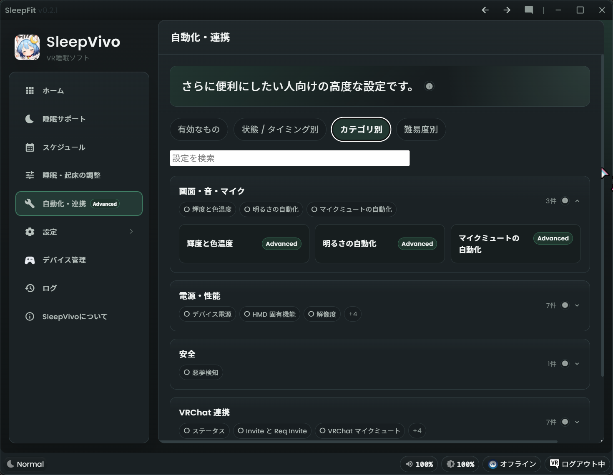
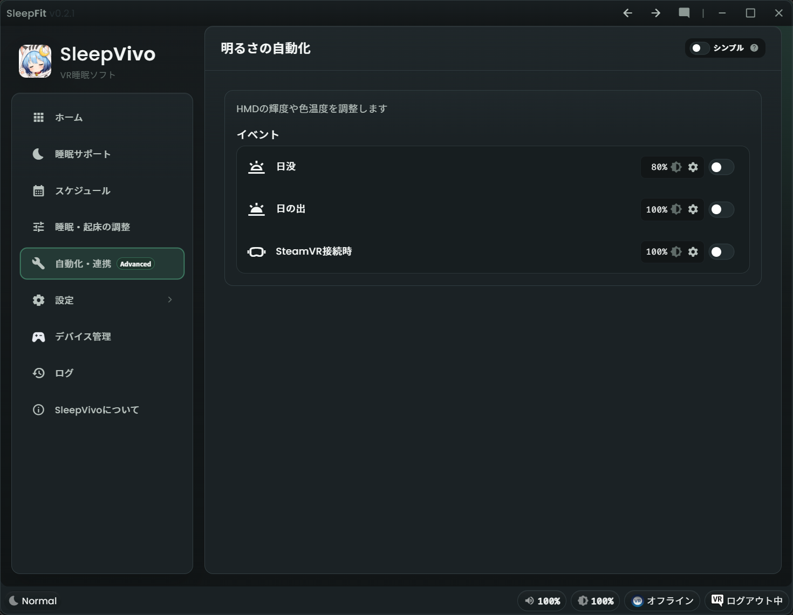
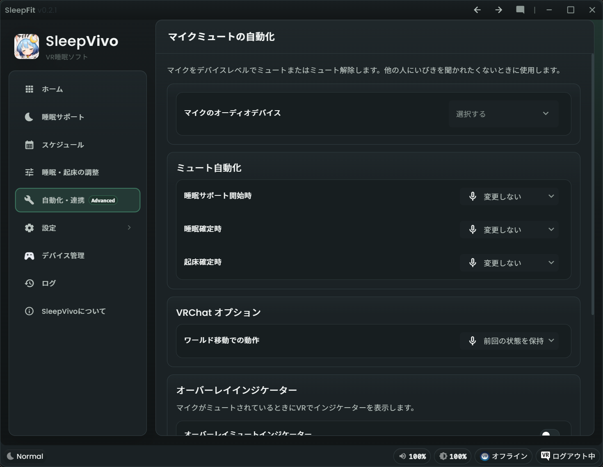
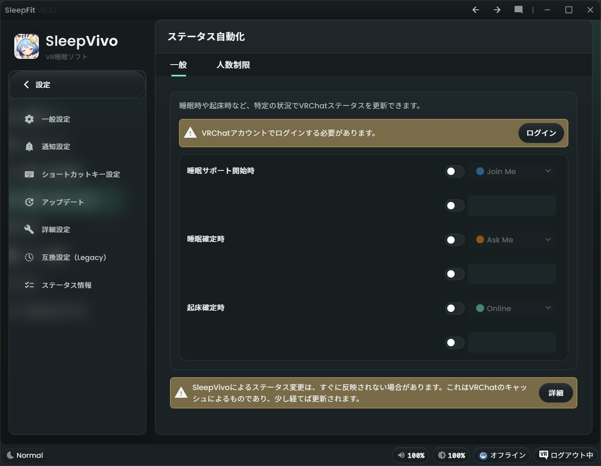
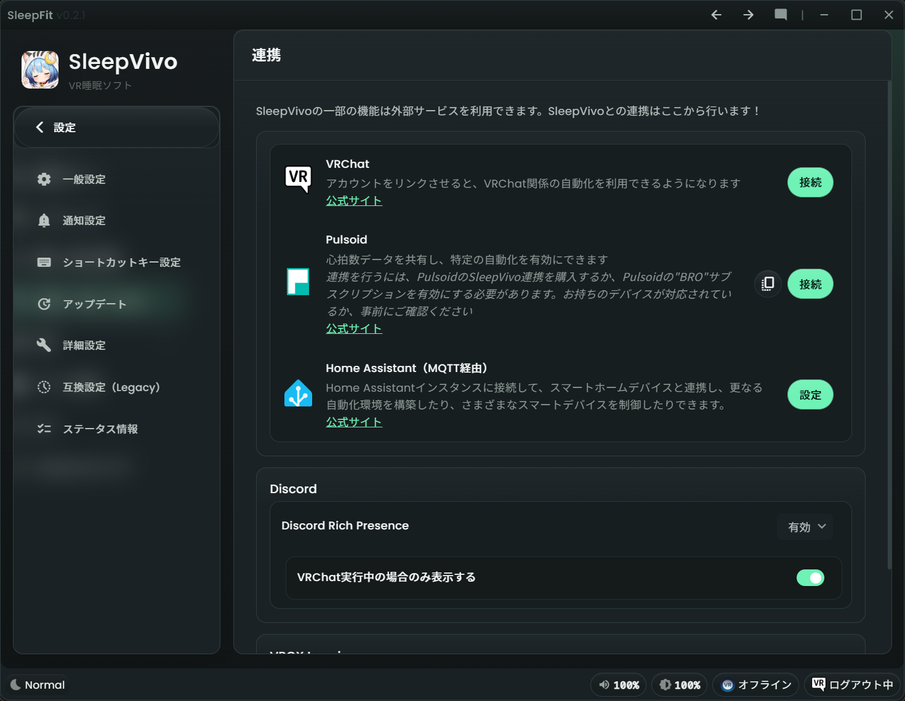

# 自動化・連携[advanced]

「自動化・連携」は、SleepVivo の高度な自動化設定を集約したページです。
VRChat、HMD、SteamVR、音、マイク、外部ツールなど、さまざまな自動化・連携機能を探す索引機能がセットになっています。

!!! warning "自動化・連携は上級者向けの設定です"
    通常の使用では自動化・連携の設定は必要ありません。より便利にしたい時だけ使ってください。
    基本的な入眠・起床だけず [睡眠サポート](sleep-support.md) と [睡眠・起床の調整](sleep-wake-settings.md) で十分です。
    自動化・連携機能は範囲が広く、環境によって動作が変わる場合があります。
    fork 元の OyasumiVR に由来する機能は、一部の機能に不具合や SleepVivo 側の整理が残っている可能性があります。

## 索引機能

「自動化・連携」には、様々な設定を探すための検索機能があります。

* 「有効なもの」：現在有効な自動化を表示します
* 「状態 / タイミング別」：睡眠サポート開始時、睡眠確定時、起床確定時、予定・時刻ベース、イベントベース、常時参照のようなタグで検索します
* 「カテゴリ別」：画面・音・マイク、電源・性能、安全、VRChat 連携、外部連携のような分類で検索します
* 「難易度別」：コア機能(core)、上級者向け機能(advanced)、難しい機能(professional)のタグで検索します
* 「設定を検索」：設定名や説明に含まれる言葉で検索します

## 分類の見方

各項目には、Core、Advanced、Professinal、Legacy のようなバッジが表示される場合があります。

1. Core は、睡眠体験の中心に近い設定です。
2. Advanced は、さらに便利にしたい人向けの高度な設定です。
3. Legacy は、互換目的で残っている設定です。新しく使う場合は、通常の導線を優先してください。

## 画面・音・マイク

### 輝度と色温度 [core]

デバイス別の輝度上限、色温度制御、明るさ制御方式を設定します。
Valve Index や Bigscreen Beyond の輝度関連設定もここで行います。

### 明るさの自動化 [core]

日の出、日の入り、HMD 接続などをきっかけにした明るさの自動化です。
睡眠サポートの基本的な明るさ調整とは別に、環境にあわせた動きを設定したい場合に確認します。

### マイクミュートの自動化 [core]

システムマイクの状態や、コントローラーバインドの挙動を設定します。
睡眠中や起床時のマイク状態を整理したい場合に確認します。

## 電源・性能

### デバイス電源 [core]

コントローラー、トラッカー、ベースステーションの電源制御を設定します。
睡眠中に不要なデバイスを止めたい場合や、SteamVR の起動・終了に合わせたい場合に確認します。

### HMD 固有機能 [core]

Bigscreen Beyond の fan / RGB など、対応 HMD 固有の機能を設定します。
対応していない HMD では効果がない場合があります。

### 解像度

睡眠確定時と起床確定時の SteamVR 解像度を設定します。
睡眠中の負荷を下げたい場合に確認します。

### フレームレート [advanced]

アプリごとのフレーム制限を設定します。
睡眠中や起床時の負荷を調整したい場合に確認します。

### ガーディアン [advanced]

SteamVR 境界のフェード距離自動化を設定します。
VR 空間での境界表示の見え方を調整したい場合に確認します。

### GPU [professional]

GPU 電力制限や MSI Afterburner 連携を設定します。
電力や発熱を抑えたい場合に使いますが、環境によって影響が大きいため注意してください。

### シャットダウン [advanced]

PC や SteamVR を停止する条件を設定します。
睡眠中に自動で終了したい場合に確認します。

## 安全

### 悪夢検知 [advanced]

Pulsoid 連携時に、心拍数をもとにアラームや睡眠解除を行う設定です。
Pulsoid 連携が必要です。

## VRChat 連携
VRChat連携には「外部連携」からVRChatへのログインが必要です。

!!! warning "VRChat連携は自己責任で行ってください"
    VRChat連携は利用実績はあるものの、VRChatから非公式に提供されている機能です。
    VRChat連携機能は自己責任で利用してください。
    ログイン情報はユーザーのPC以外に保存されず、認証のためだけにVRChatサーバーへ送信されます。
    またSleepVivoはユーザーの認証情報をVRChat連携以外には利用しません。

### ステータス [advanced]

睡眠サポート開始時、睡眠確定時、起床確定時の VRChat ステータスを設定します。
ステータスメッセージの変更も含まれます。

### Invite と Req Invite [advanced]

Invite / Req Invite の自動処理や、プリセット切り替えを設定します。
睡眠中の招待対応を調整したい場合に確認します。

### VRChat マイクミュート [advanced]

OSC 経由で VRChat マイクの状態を自動制御します。
VRChat 内で OSC が有効である必要があります。

### アバター変更 [advanced]

睡眠サポート開始時、睡眠確定時、起床確定時のアバター切り替えを設定します。

### グループ変更 [advanced]

表示中の VRChat グループを自動で切り替えます。

### Join 通知 [advanced]

プレイヤーの入退室通知やサウンドを設定します。

### 睡眠アニメーション [advanced]

姿勢 OSC と foot lock の自動化です。
アバター側の対応や OSC 設定が関係します。

## 外部連携

### 外部連携 [advanced]

VRChat、Pulsoid、Home Assistant、Discord、VRCX との接続を設定します。
外部サービスを使う機能は、先にここで接続状態を確認します。

### OSC 設定 [professional]

OSC の送信先、カスタムターゲット、OSC サーバー受信を設定します。
VRChat 連携や OSC 自動化を使う場合に確認します。

### OSC 自動化 [professional]

睡眠サポート開始時、睡眠確定時、起床確定時に任意の OSC スクリプトを送信します。
アバターや外部ツールに合わせた細かい制御をしたい場合に使います。

### コマンド実行 [professional]

睡眠サポート開始時、睡眠確定時、起床確定時に Windows コマンドを実行します。
実行するコマンドの内容によっては PC の状態に影響するため、内容がわかる場合だけ使ってください。

