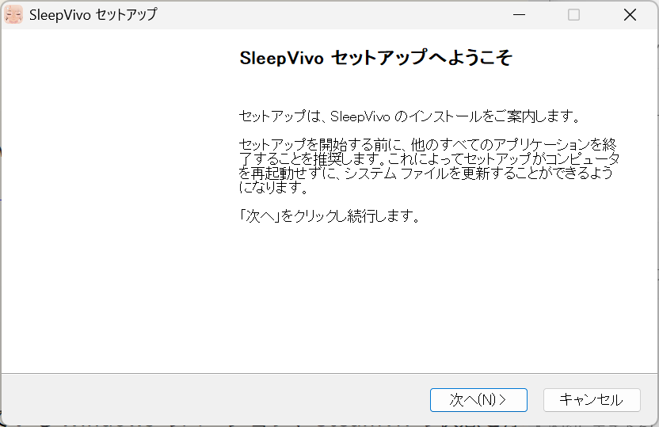
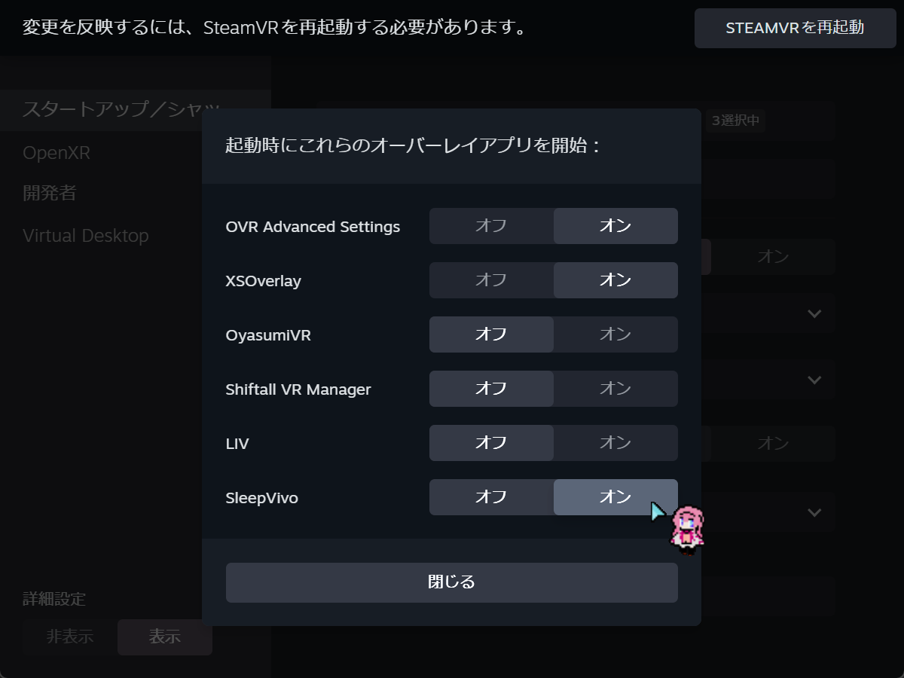

# インストール

SleepVivo は現在 Pre-Alpha 版です。
現時点ではSteamなどのストア配布ではなく、インストーラーを使う配布形態となっています。
バージョンアップの際は、Windows＞プログラムのアンインストールまたは変更 から旧版を削除の上でインストールしてください。

!!! warning "配布方法は開発中です"
    このページは、現在のインストーラーをDiscord等で手動配布する前提で説明します。
    正式なダウンロードページや自動更新などは、決まり次第更新します。

## インストール前に確認すること

1. VR 環境と SteamVR が利用できる環境を準備してください。
2. 配布された SleepVivo のインストーラーをダウンロードしてください。
3. 以前の Pre-Alpha 版を入れている場合は、必要に応じて設定やログを控えた上で、設定情報を含めアンインストールしてください。

## インストール手順

1. 配布されたインストーラーを起動します。
2. 画面の案内に従ってインストールします。
3. インストール後、SleepVivo を起動します。
4. 初めて使う場合は、[初回設定](first-setup.md)へ進みます。

## SteamVR への登録

インストール後、SteamVR 起動時に SleepVivo が自動で起動する設定をおすすめします。

!!! warning "自動起動には手動で設定が必要です"
    SteamVR 起動時に SleepVivo も一緒に起動する設定は、自動では ON になりません。

SleepVivo を 自動で起動する場合は、以下の手順で設定します。

1. SleepVivo をインストールします
2. SteamVR を起動します
3. SleepVivo を起動します
3. SteamVR の「設定」を開きます
4. 「スタートアップ/シャットダウン」を開きます
5. 「スタートアップオーバーレイアプリを選択」を開きます
6. SleepVivo を「オン」にします
7. SleepVivoを修了したあと、SteamVRを再起動します
8. SteamVR と同時にSleepVivo が起動することを確認します

!!! warning "初回設定時はSteamVRを立ち上げてからSleepVivoを起動してください"
    SleepVivo を先に起動していると、SteamVRのスタートアップオーバーレイアプリに表示されない場合があります。

アプリ内でも、「設定」>「一般設定」>「起動と終了」>「SteamVRと起動」の「詳細」から、同じ案内を確認できます。

## 更新する場合

1. 新しいインストーラーを入手します。
2. SleepVivo を終了します。
3. Windowsの設定＞アプリ＞インストールされているアプリ から旧バージョンをアンインストールしてください。設定データも削除してください。
4. 新しいインストーラーを実行します。

!!! note "Pre-Alpha 版の更新"
    更新方法や保存データの扱いは、ビルドごとに変わる可能性があります。
    配布時に個別の注意がある場合は、その案内を優先してください。

## アンインストール

1. Windowsの設定＞アプリ＞インストールされているアプリ を開きます。
2. SleepVivo を探します。
3. アンインストールを実行します。Pre-Alpha版では設定データもあわせて削除してください。

## 推奨システム要件
* 64 ビットプロセッサとオペレーティングシステムが必要です
* OS: Windows 10 / 11
* プロセッサー: Core i7 / Ryzen 5 以上
* メモリー: 8 GB RAM 以上
* グラフィック: GPU with 6GB VRAM or higher (GTX 1080 8GB, RTX2070)
* DirectX: Version 11
* ストレージ: 500 MB 以上の空き容量
* VRサポート: SteamVR
