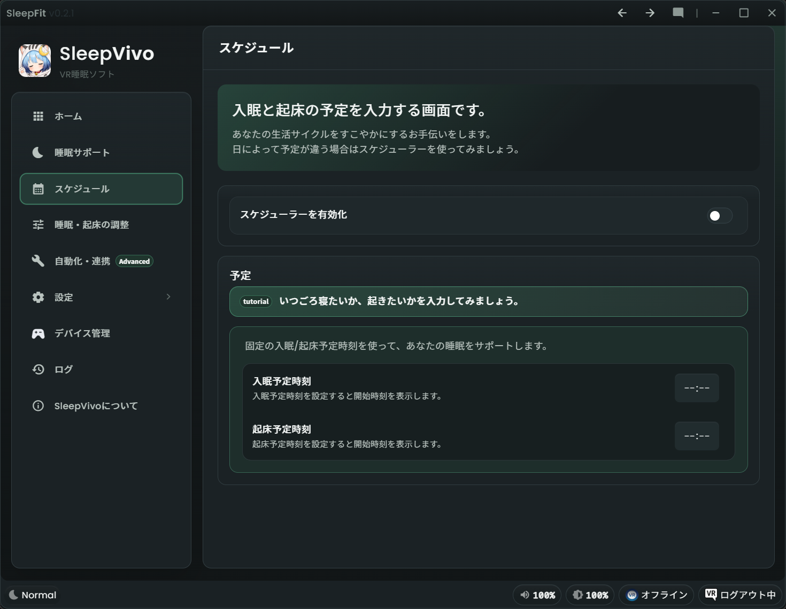
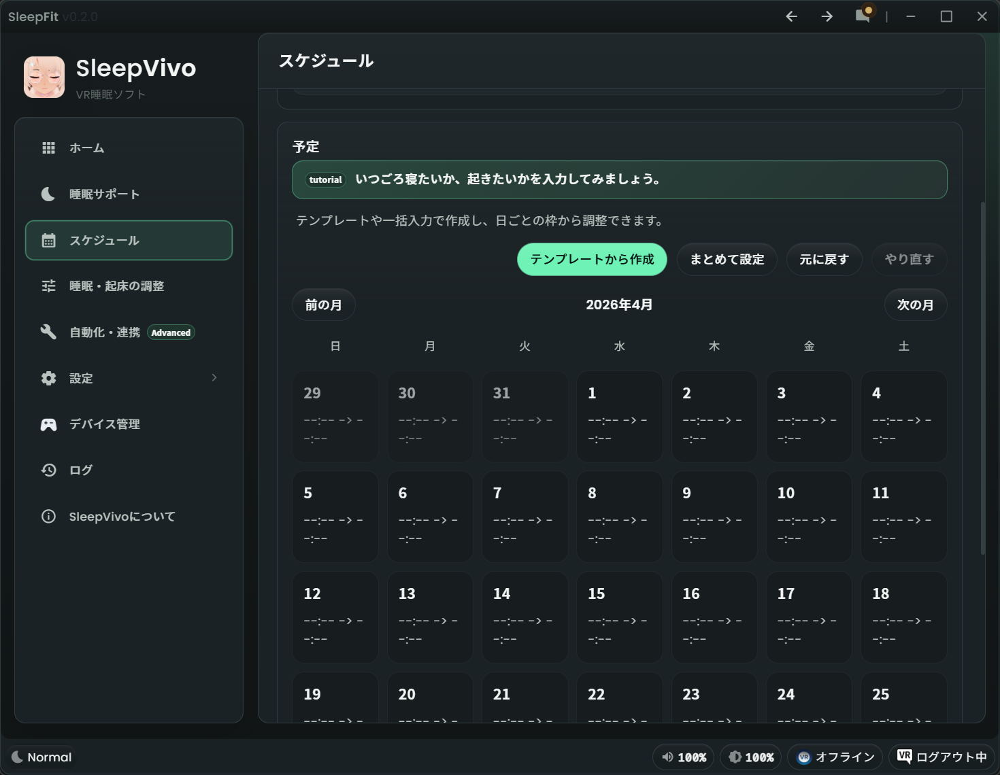
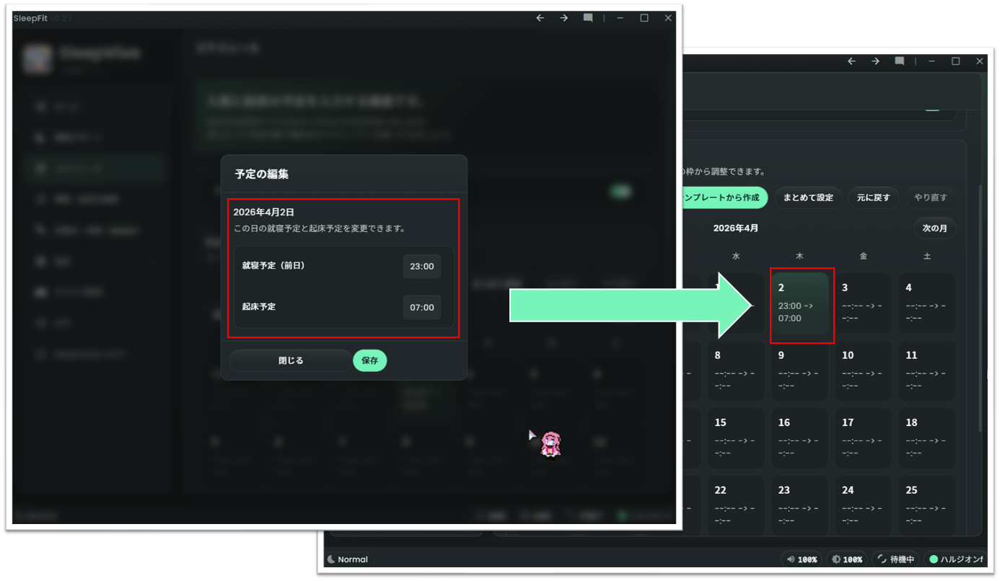
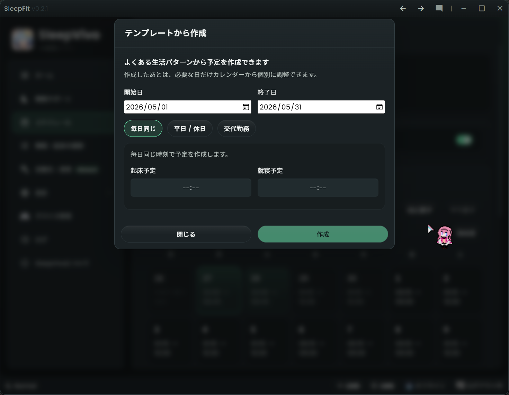
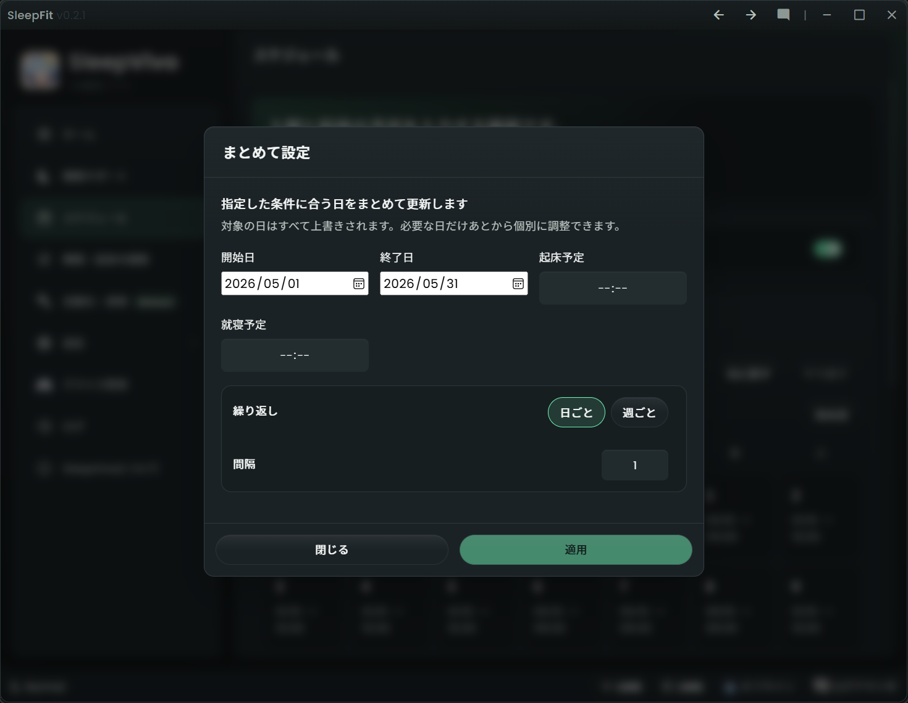
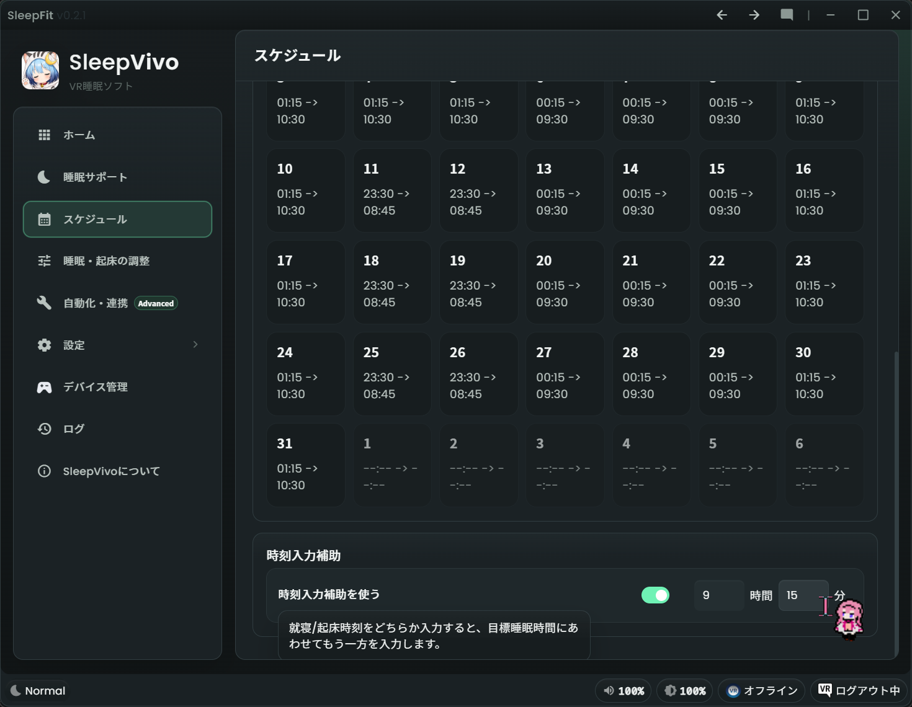

# スケジュール

「スケジュール」ページでは、入眠と起床の予定を入力します。
毎日同じ予定なら固定時刻、日によって違う予定ならスケジューラーを使います。

## どちらを使うか

* 毎日ほぼ同じ時刻で使う場合は、「スケジューラーを有効化」を OFF にします（デフォルト）
* 日ごとに睡眠予定が変わる場合は、「スケジューラーを有効化」を ON にします。

## 固定時刻で使う

1. 左メニューの「スケジュール」を開きます。
2. 「スケジューラーを有効化」を OFF にします。
3. 「入眠予定時刻」を入力します。
4. 「起床予定時刻」を入力します。
5. 左メニューの「睡眠サポート」に戻り、「時刻の詳細」に反映されているか確認します。

## スケジューラーを使う

1. 左メニューの「スケジュール」を開きます。
2. 「スケジューラーを有効化」を ON にします。
3. カレンダーが表示されます。日付をクリックすると予定の編集画面が表示されます。
4. 「予定の編集」で「就寝予定（前日）」と「起床予定」を入力します。「保存」を押すと確定されます。

!!! note "就寝予定（前日）について"
    カレンダーの日付は起床する日を中心に扱います。
    夜に寝て翌朝起きる予定では、就寝は前日の時刻として入力します。
    （例：4/2欄に23:00 => 07:00 と入力されている場合は、4/1 23:00に就寝し、4/2 7:00に起床する設定です）

## テンプレートから作成

「テンプレートから作成」は、よくある生活パターンをまとめて入力する機能です。

1. 「テンプレートから作成」を押します。
2. 「開始日」と「終了日」を選びます。
3. 生活パターンを選びます。
4. 「毎日同じ」を選ぶ場合は、毎日の「起床予定」と「就寝予定」を入力します。
5. 「平日 / 休日」を選ぶ場合は、平日と休日それぞれの予定を入力します。
6. 「交代勤務」を選ぶ場合は、「サイクル日数」と各日の予定を入力します。
7. 「作成」を押します。

## まとめて設定

「まとめて設定」は、指定した条件に合う日を一括で更新する機能です。

1. 「まとめて設定」を押します。
2. 「開始日」と「終了日」を選びます。
3. 「起床予定」と「就寝予定」を入力します。
4. 「繰り返し」で「日ごと」または「週ごと」を選びます。
5. 「間隔」を入力します。
6. 「週ごと」を選んだ場合は、対象の曜日を選びます。
7. 「適用」を押します。

!!! warning "一括入力は上書きです"
    「まとめて設定」で対象になった日は上書きされます。
    必要な日だけ、あとからカレンダーで個別に調整できます。

## 時刻入力補助

スケジューラーを有効化している場合は、「時刻入力補助」を使えます。
就寝時刻または起床時刻のどちらかを入力すると、目標睡眠時間にあわせてもう一方を入力します。

1. 「時刻入力補助を使う」を ON にします。
2. 目標睡眠時間を「時間」と「分」で入力します。
3. 予定編集時に、就寝または起床の片方を入力します。
4. もう片方が補助されるか確認します。

## 元に戻す・やり直す

1. 直前の変更を取り消す場合は「元に戻す」を押します。
2. 取り消した変更を戻す場合は「やり直す」を押します。
