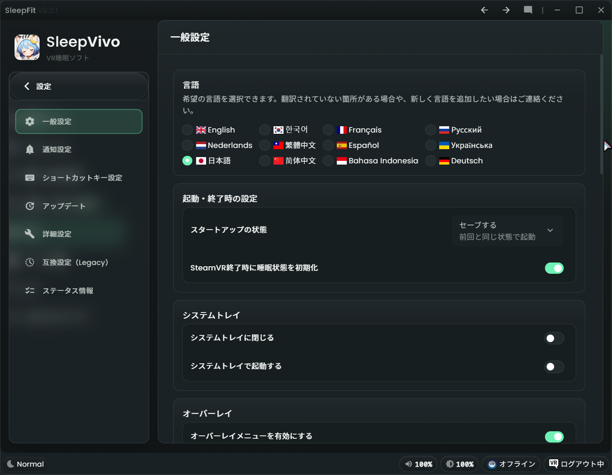
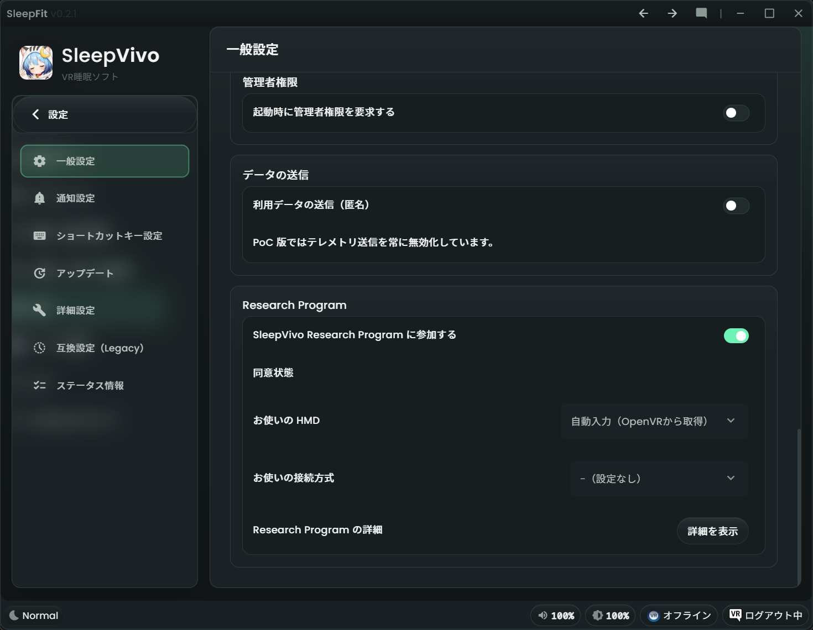
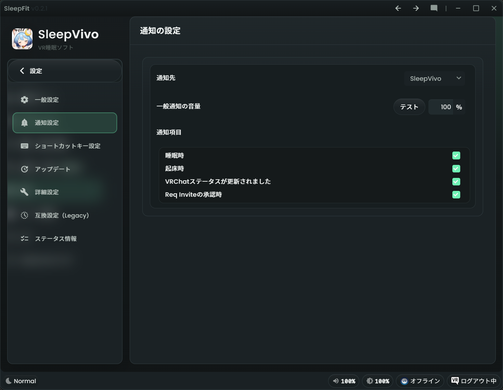
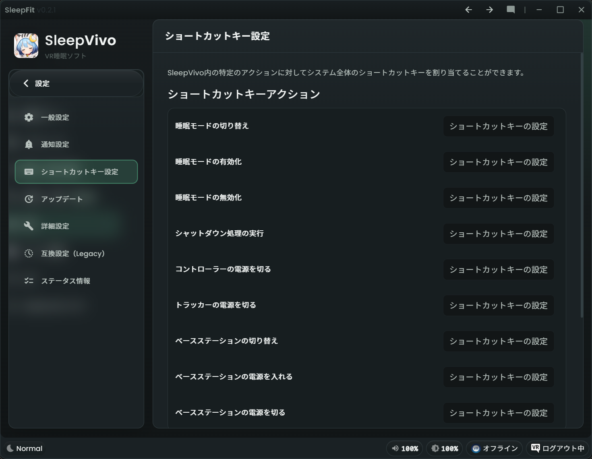
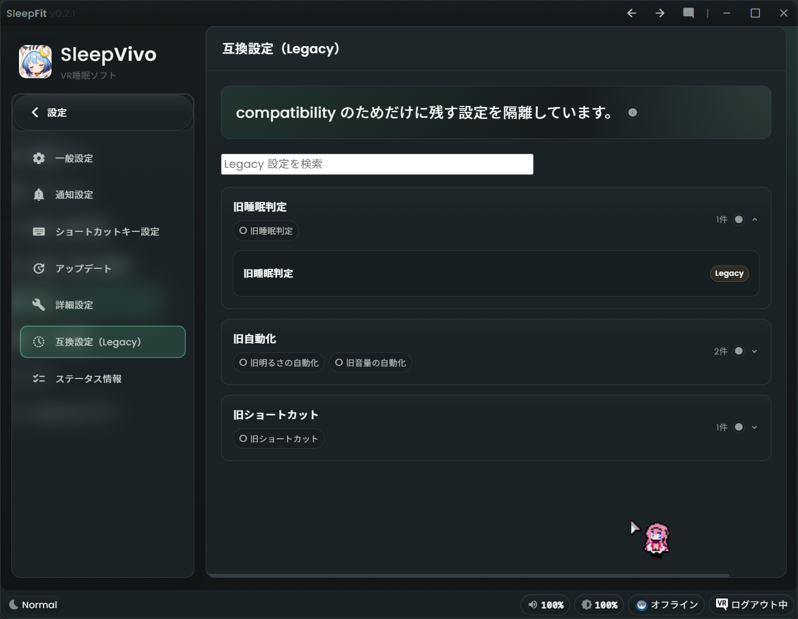
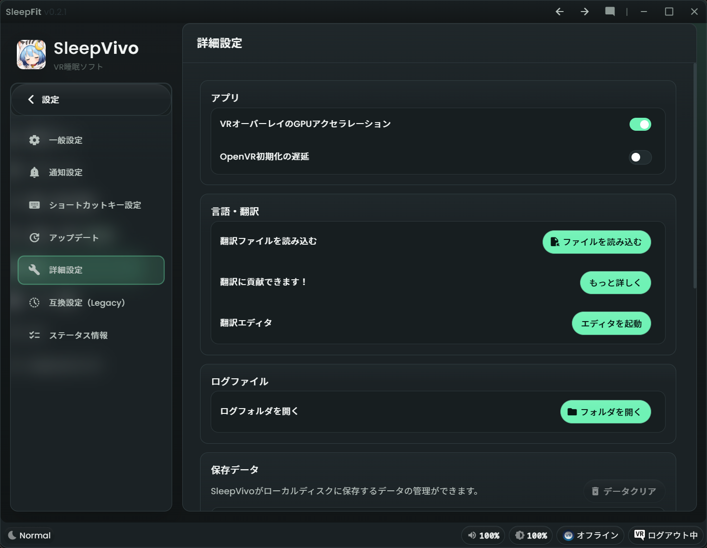

# 設定

「設定」ページでは、SleepVivo 全体の動作、通知、ショートカットキー、更新、詳細設定、状態情報を確認できます。
睡眠サポートの基本設定だけなら、通常は多くの項目を変更する必要はありません。

## 設定を開く

1. 左メニューの「設定」を押します。
2. サブメニューから目的の設定画面を選びます。
3. 変更したい項目だけ確認します。

## 一般設定

「一般設定」では、アプリ全体の基本動作を設定します。

1. 「言語」で表示言語を選びます（※現在は日本語のみ対応完了となっています）
2. 「起動・終了時の設定」：SleepVivo 起動時の睡眠モード状態を選びます。
3. 「SteamVR終了時に睡眠状態を初期化」：SteamVR 終了時に通常状態へ戻すか選びます。
4. 「システムトレイ」：閉じる操作や起動時の最小化を設定します。
5. 「オーバーレイ」：SleepVivo のオーバーレイメニューとコントローラーバインディングを設定します。
6. 「SteamVRベースステーションの電源制御」：ベースステーションの電源制御を設定します。
7. 「起動と終了」：SteamVR と一緒に起動・終了する動作を確認します。
8. 「Lighthouseコンソール」：`lighthouse_console.exe` の場所を指定します。
9. 「管理者権限」：起動時に管理者権限を要求するか選びます。

Overlay の使い方は [VR Overlay](vr-overlay.md) を確認してください。

## Research Program

「一般設定」内の「Research Program」では、SleepVivo Research Program への参加を設定できます。
参加は任意です。
OFF のままでも SleepVivo の通常機能は利用できます。

1. 「SleepVivo Research Program に参加する」を ON にします。
2. 同意画面の内容を確認します。
3. 参加する場合は「同意して参加する」を押します。
4. 参加しない場合は「参加しない」を押します。
5. 参加後に停止したい場合は、同じトグルを OFF にします。
6. 「Research Program の詳細」の「詳細を表示」：送信される情報、送信されない情報、利用目的、外部共有、保存期間を確認します。

詳しくは [同意と参加](../research-program/consent.md) を確認してください。

## 通知の設定

「通知の設定」では、通知先、音量、通知項目を設定します。

1. 「通知先」で使いたい通知先を選びます。
2. 「一般通知の音量」で通知音の音量を調整します。
3. 「テスト」で音量を確認します。
4. 「通知項目」：受け取りたい通知を選びます。

表示されている通知項目には、「睡眠時」「起床時」「VRChatステータスが更新されました」「Req Inviteの承認時」などがあります。

## ショートカットキー設定

「ショートカットキー設定」では、SleepVivo の操作にシステム全体のショートカットキーを割り当てられます。

1. 設定したいアクションを探します。
2. 右側のショートカットキー入力欄を選びます。
3. 使いたいキーの組み合わせを入力します。

互換設定（Legacy）のショートカットは、OyasumiVRで実装されていた機能を使いたい方向けの互換モードです。
新しく設定する場合は、まず「睡眠・起床の調整」を確認してください。

## アップデート

「アップデート」は、現在のPre-Alpha版では無効になっています。
自動更新は無効化されており、また開発履歴はfork元のOyasumiVRのものです。

## 詳細設定

「詳細設定」は、通常は変更しなくてよい項目です。
必要なときだけ開いてください。

1. 「アプリケーション」：オーバーレイ GPU アクセラレーションなどを確認します。
2. 「言語・翻訳」：翻訳ファイルの読み込みや翻訳エディタを開けます。
3. 「ログファイル」：ログフォルダーを開けます。
4. 「保存データ」：SleepVivo がローカルディスクに保存するデータを管理できます。
5. 「トラブルシューティング」：SteamVR アプリケーションマニフェストの再登録や raw log の記録量を確認できます。

!!! warning "保存データの削除"
    保存データを消すと、設定や連携情報が失われる場合があります。
    不安な場合は、操作前に Discord で相談してください。

## 状態情報

「状態情報」では、サポート時に役立つ現在の状態を確認できます。

1. 「状態情報」を開きます。
2. 「コピー」を押すと、表示されている情報をまとめてコピーできます。
3. 問い合わせ時に必要な場合だけ共有してください。

## 関連する設定画面

「自動化・連携」から開く設定画面にも、環境調整に関わる項目があります。

1. 「輝度と色温度」では、色温度制御、Valve Index、Bigscreen Beyond の輝度制限などを設定します。
2. 「外部連携」では、VRChat、Pulsoid、Home Assistant、Discord、VRCX との連携を設定します。
3. 「OSC 設定」では、VRChat OSCQuery、カスタム OSC 送信先、OSC サーバー受信を設定します。

## 困ったとき

設定の意味がわからない場合は、無理に変更しないでください。
Pre-Alpha 版では、小さな問題や不明点でも Discord でハルジオン @fleabane_haru に連絡してください。
