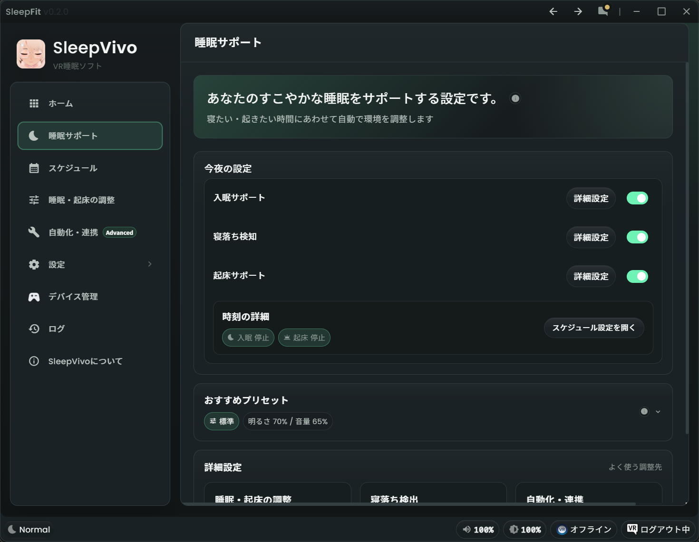

# 睡眠サポート

「睡眠サポート」は、SleepVivo の基本機能の入口です。
入眠サポート、寝落ち検知、起床サポートの設定をここから調整します。

SleepVivo 全体の流れは [SleepVivo の基本機能](basic-functions.md) を確認してください。
また睡眠・起床予定時刻が未設定の場合は [初回設定](first-setup.md) を確認してください。

## 基本設定

左メニューの「睡眠サポート」を開いて設定画面に入ります。
* 「今夜の設定」：「入眠サポート」「寝落ち検知」「起床サポート」の有効/無効を設定します
* 「時刻の詳細」：設定済みの入眠予定時刻と起床予定時刻を表示します
* 「スケジュール設定を開く」：予定時刻の入力画面に移動します

## 入眠サポート

入眠サポートは、寝る時刻に向けて明るさ、色温度、音量をやわらかく切り替え、スムーズな入眠をサポートする機能です。
[SleepVivo の基本機能](basic-functions.md) での「入眠中」はこの機能が動作している状態です。

* 「今夜の設定」で「入眠サポート」を ON にすると有効になります
* 入眠予定時刻を設定すると、予定時刻にあわせて自動的に画面と音が眠りやすいように調整されます
* 手動で入眠サポートを開始したい場合は、デスクトップGUIの `今から寝る`または VR Overlay の `Sleep now` を使います

入眠サポートにかける時間や、`Not yet` 後の再誘導は [睡眠・起床の調整](sleep-wake-settings.md) で変更できます。

## 寝落ち検知

寝落ち検知は、眠ったと判断したあとに睡眠中向けの状態へ切り替えるための機能です。
 [SleepVivo の基本機能](basic-functions.md) での「睡眠中」はこの寝落ち検知が働いたあとの状態です。

* 「今夜の設定」で「寝落ち検知」を ON にすると有効になります
* 寝落ちを検知すると、SleepVivo が睡眠中向けに画面や音量を調整します
* 設定している場合は、対応する自動化・連携が実行されます
* 寝落ち検知の感度や条件を調整したい場合は、[睡眠・起床の調整](sleep-wake-settings.md) の「寝落ち検知」を参照してください

## 起床サポート

起床サポートは、起きる時刻にあわせて画面や音量を調整し、すっきり目覚めやすいようにサポートする機能です。
ユーザーが指定した起床時刻が近づくか、動きから起床が近づいたことを検知すると、自動的に「起床中」のステータスになります。
[SleepVivo の基本機能](basic-functions.md) での「起床中」はこの機能が動作している状態です。

* 「今夜の設定」で「起床サポート」を ON にすると有効になります
* 起床予定時刻を設定すると、予定時刻にあわせて自動的に画面と音を目覚めが良くなるように調整します
* 起床サポートを中断し、起床する場合は、デスクトップGUIの`もう起きた`または VR Overlay の `I am awake` を押してください
* まだ寝たい場合は、 デスクトップGUIの`まだ寝たい`または VR Overlay の `Keep sleeping` を押してください

起床サポートにかける時間や、睡眠開始から一定時間後に起床サポートを始める設定は [睡眠・起床の調整](sleep-wake-settings.md) で変更できます。

## おすすめプリセット

「おすすめプリセット」では、入眠サポート時の明るさや音量などの設定を一括で調整できます。

* 「標準」：初めて使うとき向けの基本設定です。
* 「しっかり暗め」：光が気になりやすい人向けです。
* 「静かに寝る」：音に敏感な人向けです。
* 「明るめ」：少し明るいほうが落ち着く人向けです。
* 「カスタム」：手動調整した睡眠サポート設定が保存されます。

## 画面と音を個別に調整する（詳細設定）

入眠/起床サポートや睡眠中の画面設定、時間設定を個別に調整したい場合は [睡眠・起床の調整](sleep-wake-settings.md) から行えます。

1. 「睡眠サポート」の「詳細設定」を押して「睡眠・起床の調整」を開きます
2. 「画面と音の調整」で、入眠サポート中、睡眠中、起床サポート中の値を確認します
3. 音量を変えたい再生デバイスがある場合は、「音量対象デバイス」で「デバイス選択」を押します
4. 入眠や起床の時間を調整したい場合は「時間設定の調整」から行えます

!!! tip "迷ったら標準のまま"
    慣れるまでは、細かい数値を大きく変えず、まずプリセットを使うことをおすすめします。
    詳細設定は眠りにくい、明るすぎる、音が大きいなど調整したいところがあった時に利用してください。

## 関連ページ

1. [初回設定](first-setup.md)：最初に入眠予定時刻と起床予定時刻を設定します。
2. [スケジュール](scheduler.md)：日ごとの予定を管理します。
3. [睡眠・起床の調整](sleep-wake-settings.md)：明るさ、色温度、音量、時間を細かく調整します。
4. [VR Overlay](vr-overlay.md)：VR 内から手動操作や調整を行います。
5. [FAQ](../support/faq.md)：よくある問題の確認先です。
