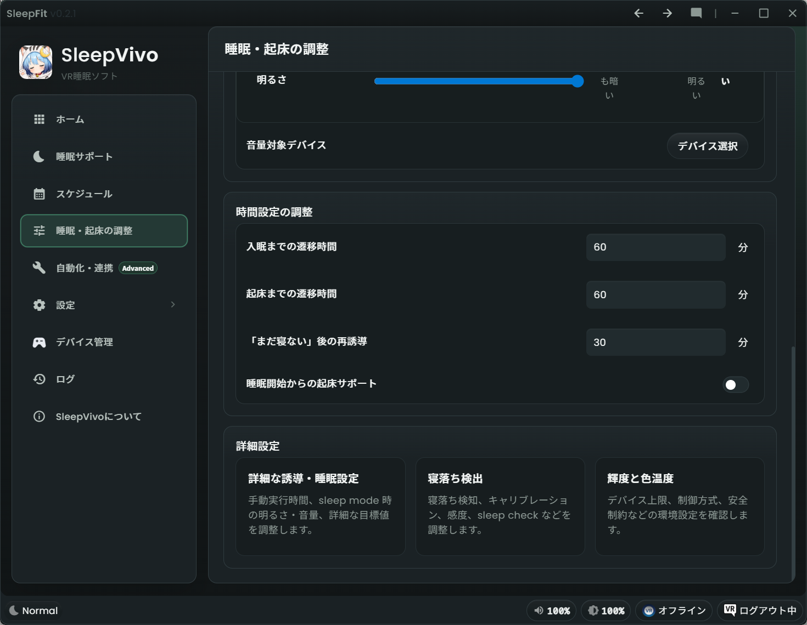

# 睡眠・起床の調整（詳細設定）

「睡眠・起床の調整」は、入眠サポート、寝落ち検知、起床サポートを細かく調整するためのページです。
左メニューの「睡眠・起床の調整」に対応します。

まずは [睡眠サポート](sleep-support.md) の基本設定を使い、明るさ、音量、時間が合わないと感じたらこのページで調整してください。
SleepVivo 全体の流れは [SleepVivo の基本機能](basic-functions.md) を確認してください。

!!! tip "迷ったら標準のまま"
    慣れるまでは、細かい数値を大きく変えず、まずプリセットを使うことをおすすめします。
    詳細設定は眠りにくい、明るすぎる、音が大きいなど調整したいところがあった時に利用してください。

## 画面と音の調整

「画面と音の調整」では、睡眠中のVRヘッドセットの画面明るさや色温度、音量などの目標値を調整します。
通常時のデバイス上限や安全制約ではなく、寝るとき・眠っているとき・起きるときにどのくらい変化させるかを決める場所です。

「入眠サポート中」「睡眠モード」「起床サポート中」については、 [SleepVivo の基本機能](basic-functions.md) と [睡眠サポート](sleep-support.md) を参照してください。

* 「明るさ」：各モード中の明るさを選びます
* 「色温度」：画面色を暖色寄りにするか、寒色寄りにするかを調整できます（色温度制御を有効にしている場合のみ表示されます）
* 「音量」：入眠開始前の音量を 100% とした相対音量を設定します

色温度はBigscreen Beyond、Valve Indexなどの一部のヘッドセットでのみ有効にできます。
有効にする場合は、 [自動化・連携[advanced]](automations.md) ＞輝度と色温度 から設定してください。

### 音量対象デバイス

音量変更を適用するオーディオ再生デバイスを選びます。
音量の自動変更の対象になるほか、デスクトップGUIやVRオーバーレイのスライダーから調整ができるようになります。

1. 「音量対象デバイス」から「デバイス選択」を押します
2. SleepVivo の音量変更を適用したい再生デバイスの「＋」ボタンを押します

## 時間設定の調整

「時間設定の調整」では、入眠サポートと起床サポートにかける時間を設定します。

* 「入眠までの遷移時間」：入眠予定時刻までに何分かけて入眠サポートを進めるかを決めます
* 「起床までの遷移時間」：起床予定時刻までに何分かけて起床サポートを進めるかを決めます
* 「`まだ寝ない` 後の再誘導」：入眠サポート中、`まだ寝ない` を押したあと、何分後に再び入眠サポートが開始するかを決めます
* 「睡眠開始からの起床サポート」： ON にすると、睡眠モードに入ってから一定時間後に起床サポートを開始します。

!!! tip "睡眠開始からの起床サポート"
    通常は「スケジュール」から就寝・起床時刻を設定して使うため、この機能はデフォルトでOFFになっています。
    もし入眠を手動で行うような場合にはこの機能を使ってください。

## 詳細設定から移動できるページ

ページ下部の「詳細設定」には、さらに細かい設定先があります。
慣れるまでは無理に変更する必要はありません。

### 詳細な誘導・睡眠設定

入眠サポートプロファイルと起床サポートプロファイルの詳細を調整します。

1. 明るさを変更するかどうか。
2. シンプル明度モードで使う「簡易明度 (%)」。
3. 高度な明度モードで使う「ソフトウェア明度 (%)」と「ハードウェア明度 (%)」。
4. 色温度制御を使う場合の「色温度 (K)」。
5. 入眠開始前の音量を 100% とした「音量 (%)」。
6. 「手動実行時の遷移時間 (秒)」と「自動実行時の遷移時間 (秒)」。
7. 睡眠モード時の画面制御、音量、遷移時間。

### 寝落ち検知

寝落ち検知の感度や条件を調整するページです。
SleepVivo 推奨の寝落ち検知を確認できます。

1. 寝落ち検知が想定どおり動かない場合に確認します。
2. 検知の感度や条件を調整したい場合に使います。
3. 旧来の互換設定は通常の導線とは分けて扱われます。

### 輝度と色温度

デバイス上限、制御方式、安全制約などの環境設定を確認するページです。

1. 色温度制御を有効にするか確認します。
2. Valve Index の最大輝度を確認します。
3. Bigscreen Beyond の最大輝度や安全関連の設定を確認します。

