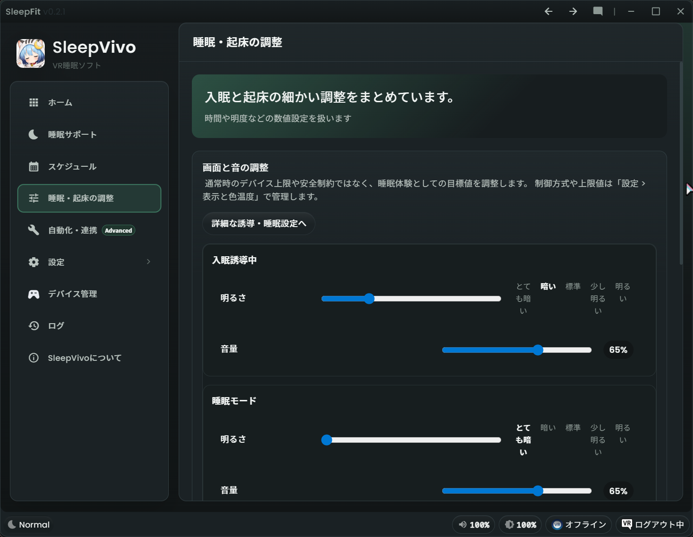
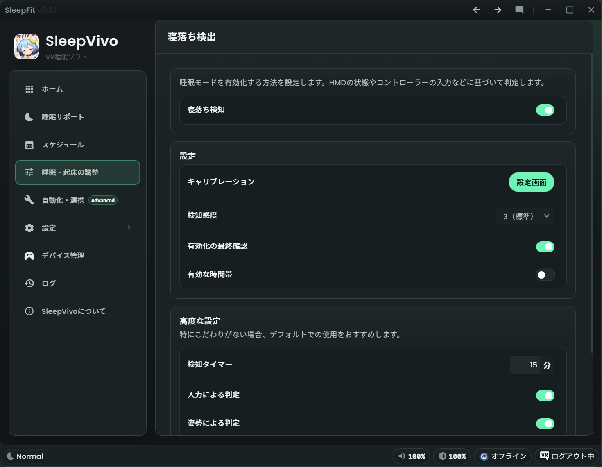
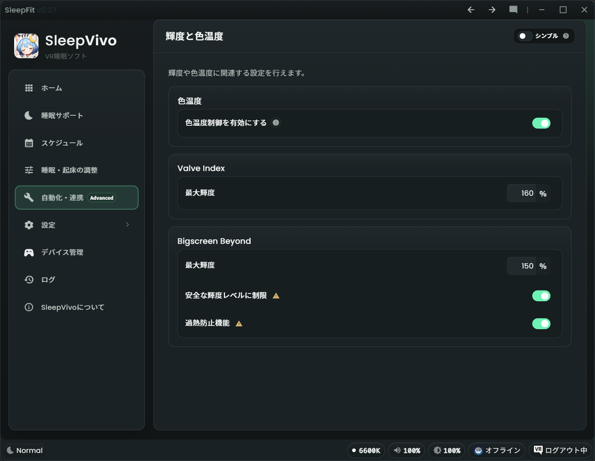

# 睡眠・起床の調整

「睡眠・起床の調整」は、入眠誘導、寝落ち検出、起床誘導を細かく調整するためのページです。
左メニューの「睡眠・起床の調整」に対応しています。

まずは [睡眠サポート](sleep-induction.md) の基本設定を使い、明るさ、音量、時間が合わないと感じたらこのページで調整してください。

!!! note "Research Program について"
    SleepVivo Research Program への参加は任意です。
    この設定ページの利用に、Research Program への参加は必要ありません。

## 睡眠サポートとの違い

「睡眠サポート」は、今夜使う基本的な ON / OFF とおすすめプリセットを扱う入口です。
「睡眠・起床の調整」は、その中身をもう少し細かく変える場所です。

1. 「睡眠サポート」では、「入眠サポート」「寝落ち検知」「起床サポート」を手早く切り替えます。
2. 「睡眠サポート」では、おすすめプリセットで明るさや音量をまとめて選びます。
3. 「睡眠・起床の調整」では、入眠誘導中、睡眠モード、起床誘導中の目標値を個別に調整します。
4. 「睡眠・起床の調整」では、入眠や起床にかける時間も調整できます。

## 開き方

1. SleepVivo を起動します。
2. 左メニューの「睡眠・起床の調整」を開きます。
3. まず「画面と音の調整」を確認します。
4. 必要に応じて「時間設定の調整」を確認します。
5. さらに細かい設定が必要な場合は、ページ下部の「詳細設定」から別ページへ移動します。

## 画面と音の調整

「画面と音の調整」では、睡眠体験としての目標値を調整します。
通常時のデバイス上限や安全制約ではなく、寝るとき・眠っているとき・起きるときにどのくらい変化させるかを決める場所です。

### 入眠誘導中

入眠予定時刻へ向けて、眠りやすい状態に近づけるための設定です。

1. 「明るさ」で、入眠誘導中の明るさを選びます。
2. 色温度制御を有効にしている場合は、「色温度」で暖色寄りにするかを選びます。
3. 「音量」で、入眠開始前の音量を 100% とした相対音量を設定します。

### 睡眠モード

寝落ち検知後に適用される状態です。

1. 「明るさ」で、睡眠モード中の明るさを選びます。
2. 色温度制御を有効にしている場合は、「色温度」を選びます。
3. 「音量」で、入眠開始前の音量を 100% とした睡眠モード中の相対音量を設定します。

### 起床誘導中

起床予定時刻へ向けて、復帰しやすい状態へ戻すための設定です。

1. 「明るさ」で、起床誘導中の明るさを選びます。
2. 色温度制御を有効にしている場合は、「色温度」を選びます。
3. 起床誘導の音量は個別指定ではなく、入眠開始前に記録した音量へ戻します。

### 音量対象デバイス

音量変更を適用する再生デバイスを選びます。

1. 「音量対象デバイス」を確認します。
2. 変更したい場合は「デバイス選択」を押します。
3. SleepVivo の音量変更を適用したい再生デバイスを選びます。

## 時間設定の調整

「時間設定の調整」では、入眠誘導と起床誘導にかける時間を設定します。

1. 「入眠までの遷移時間」で、入眠予定時刻までに何分かけて入眠誘導を進めるかを決めます。
2. 「起床までの遷移時間」で、起床予定時刻までに何分かけて起床誘導を進めるかを決めます。
3. 「『まだ寝ない』後の再誘導」で、いったん見送ったあと何分後に再び入眠誘導するかを決めます。
4. 「睡眠開始からの起床サポート」を ON にすると、睡眠モードに入ってから一定時間後に起床誘導を始められます。

## 詳細設定から移動できるページ

ページ下部の「詳細設定」には、さらに細かい設定先があります。
慣れるまでは無理に変更する必要はありません。

### 詳細な誘導・睡眠設定

入眠誘導プロファイルと起床誘導プロファイルの詳細を調整します。

1. 明るさを変更するかどうか。
2. シンプル明度モードで使う「簡易明度 (%)」。
3. 高度な明度モードで使う「ソフトウェア明度 (%)」と「ハードウェア明度 (%)」。
4. 色温度制御を使う場合の「色温度 (K)」。
5. 入眠開始前の音量を 100% とした「音量 (%)」。
6. 「手動実行時の遷移時間 (秒)」と「自動実行時の遷移時間 (秒)」。
7. 睡眠モード時の画面制御、音量、遷移時間。

### 寝落ち検出

寝落ち検知の感度や条件を調整するページです。
SleepVivo 推奨の寝落ち検知を確認できます。

1. 寝落ち検知が想定どおり動かない場合に確認します。
2. 検知の感度や条件を調整したい場合に使います。
3. 旧来の互換設定は通常の導線とは分けて扱われます。

### 輝度と色温度

デバイス上限、制御方式、安全制約などの環境設定を確認するページです。

1. 色温度制御を有効にするか確認します。
2. Valve Index の最大輝度を確認します。
3. Bigscreen Beyond の最大輝度や安全関連の設定を確認します。

## 困ったとき

設定を変えて眠りにくくなった場合は、まず「睡眠サポート」のおすすめプリセット「標準」に戻してください。
どの数値を戻せばよいかわからない場合は、変更した項目と画面のスクリーンショットを添えて Discord でハルジオン @fleabane_haru に連絡してください。

### 確認チェックリスト

- source files consulted: `U:\dev\SleepVivo-public\AGENTS.md`, `U:\dev\SleepVivo-public\mkdocs.yml`, `U:\dev\SleepVivo\src-ui\app\views\dashboard-view\views\sleep-wake-adjustments-view\sleep-wake-adjustments-view.component.html`, `U:\dev\SleepVivo\src-ui\app\views\dashboard-view\views\sleep-wake-detailed-induction-view\sleep-wake-detailed-induction-view.component.html`, `U:\dev\SleepVivo\src-ui\app\views\dashboard-view\views\sleep-detection-view\sleep-detection-view.component.html`, `U:\dev\SleepVivo\src-ui\app\views\dashboard-view\settings-navigation-catalog.ts`
- assumptions made: `sleep-wake-settings.md` は `mkdocs.yml` の nav に合わせて `docs/user-guide/sleep-wake-settings.md` として作成する
- items requiring human confirmation: 「寝落ち検出」ページ内の感度・条件の詳細をどこまで公開説明するか
