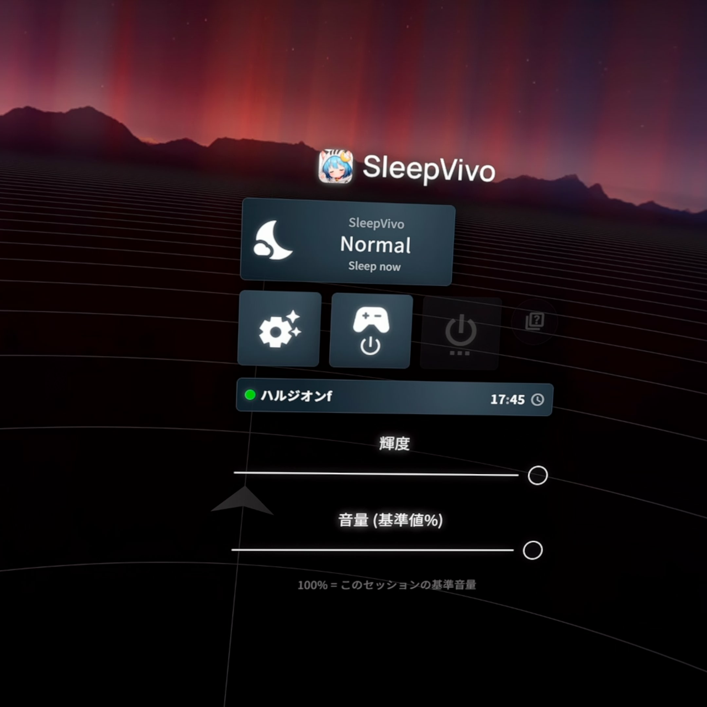
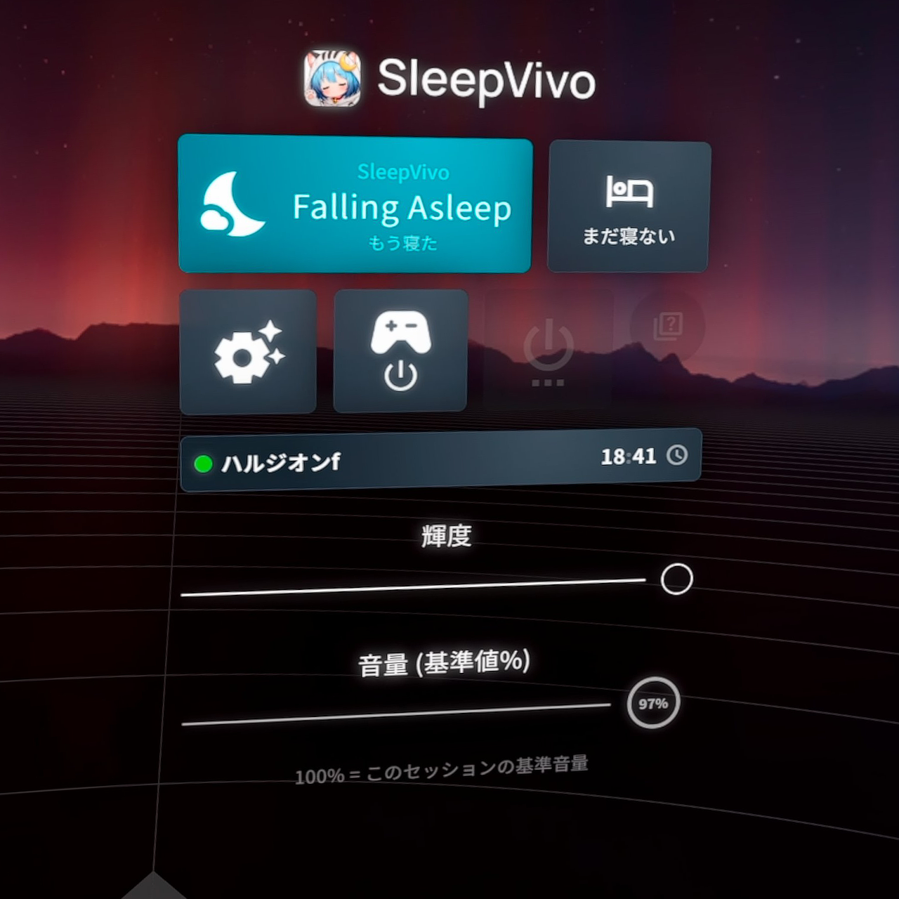

# VR Overlay

VR Overlay は、VR 内から SleepVivo の主な操作を行うためのメニューです。
HMD を外さずに、眠る準備、起きる操作、明るさや音量の調整、Research Program のアンケート回答ができます。

SleepVivo の基本的な流れは、デスクトップGUIと VR Overlay で共通です。
全体像は [SleepVivo の基本機能](basic-functions.md) を確認してください。

## 開く前に確認すること

1.   [インストール](installation.md) での初期設定が完了していることを確認してください
2. SteamVR と SleepVivo を起動します
3. 「設定」>「一般設定」>「オーバーレイ」で「オーバーレイメニューを有効にする」が ON か確認します
4. 「コントローラーバインディング」で、Overlay を開く操作が割り当てられているか確認します
5. 必要に応じて「VRChatが実行中の場合のみメニューを開く」を ON にします

## 画面の開き方

* Oculus / Quest Touch系：右Aボタン 2連打
* Valve Index：右Aボタン 2連打
* Vive Wand：右メニューボタン 2連打
* その他のSteamVRコントローラー：SteamVR Inputのカスタムバインディングで `Open Overlay Menu` を任意ボタンのdoubleに割り当てください

## 画面の見方と基本操作

オーバーレイ のメインボタンには SleepVivo の状態と、今できる操作が表示されます。
表示される操作は、今の睡眠サポートの進み具合に合わせて変わります。
例えば以下の画像の状況だと、

* 現在の状態は`睡眠サポート中`です
* メインボタン(大)を押すと`もう寝た` が送信されます
* サブボタン(小)を押すと `まだ寝ない` が送信されます

| オーバーレイの表示| 表示される場面 | 押したときの動き |
| --- | --- | --- | --- |
| `今から寝る` | 通常 | 眠る準備を開始します。 |
| `まだ寝ない` | 入眠中 | いったん眠る準備をやめます。設定している場合は、あとでもう一度眠る準備が始まります。 |
| `もう寝た` | 入眠中 | すぐに睡眠中向けの状態へ切り替えます。 |
| `もう起きた` | 睡眠中 | 起きたものとして扱い、起きる方向へ戻します。 |
| `まだ寝る` | 起床中 | まだ眠るものとして扱い、睡眠中向けの状態へ戻します。 |
| `もう起きた` | 起床中 | 起きたものとして扱い、起床サポートを完了します。 |

SleepVivoのステータスについては [SleepVivoの基本機能](basic-functions.md) をご覧ください。

## 入眠前の操作

* `今から寝る` を押すと、SleepVivo は睡眠サポートを開始します。
* 画面や各種設定が「睡眠サポート」や「睡眠・起床の調整」、「自動化・連携」で設定した内容にあわせて変更されます。

* 入眠サポートが開始されたが、まだ起きていたい場合は`まだ寝ない` を押します。
* 画面や音は元の状態へ復帰し、設定された一定時間後にあとでもう一度眠る準備が始まります。

* 入眠サポート中で、すぐに眠りたい場合は`もう寝た` を押します。
* SleepVivo は睡眠中の設定へ切り替わります。

## 起床時の操作

* 起床サポート中に、まだ眠りたい場合は `まだ寝る` を押します。
* SleepVivo は睡眠中の設定へ戻ります。

* 起床サポート中に、もう起きている場合は `もう起きた` を押します。
* 起床サポートが完了し、画面と音は通常状態へ復帰します。

* 睡眠中に手動で起きる場合も`もう起きた` を押します。

## 明るさ・色温度・音量を調整する

Overlay の下部では、表示されているスライダーをドラッグして調整できます。

* 「簡易明度」は、全体の明るさを調整します（高度な明度制御が有効の場合は「ソフトウェア明度」と「ハードウェア明度」が分かれて表示されます）
*  「音量 (基準値%)」は、その睡眠セッション開始時の音量を 100% として調整します
*  色温度制御が有効な場合は、温度計のボタンで色温度スライダーへ切り替えられます

表示されない項目は、その環境または設定では使えません。

## その他のボタン

Overlay には、環境によって次のボタンが表示されます。

1. 歯車ボタン：Overlay から切り替えられる自動化を表示します。
2. コントローラーボタン：コントローラーやトラッカーの電源操作を表示します。
3. 電源ボタン：シャットダウン手順を開始します。設定が有効でない場合は押せません。
4. ？ボタン：Research Program のアンケートを開きます。参加中で、回答対象がある場合だけ使えます。

## Research Program のアンケート

Research Program への参加は任意です。
参加していない場合、Overlay のアンケートは開けません。

参加中で回答対象の睡眠セッションがある場合、Overlay にクイズのボタンが表示されます。
アンケートでは、次のような睡眠後の質問に 1 から 5 の数字で回答します。

1. 寝つきやすさ
2. 睡眠への満足度
3. 起きたときのすっきり感

送信されるのは、選んだ数字、質問の種類、回答対象の睡眠セッションを結びつけるための情報です。
氏名、VRChat アカウント、音声、映像、スクリーンショットは送信されません。

詳しくは [Research Program 概要](../research-program/overview.md) と [収集される情報](../research-program/collected-data.md) を確認してください。
